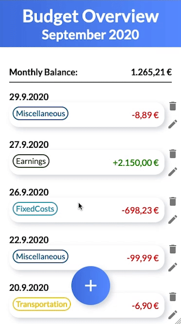
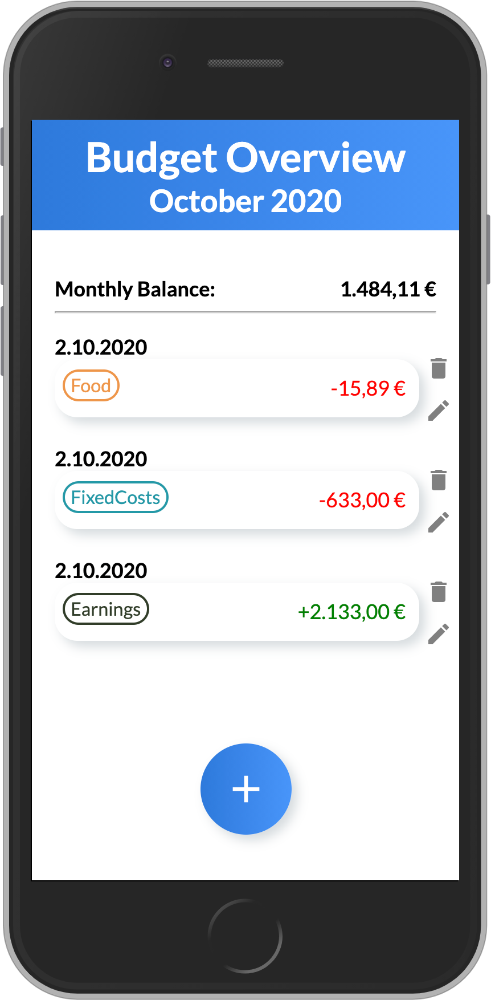
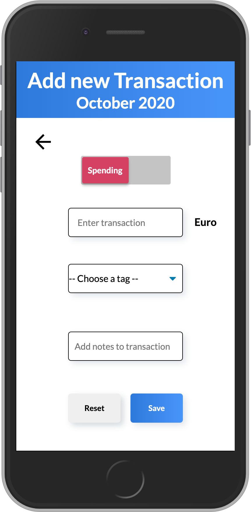
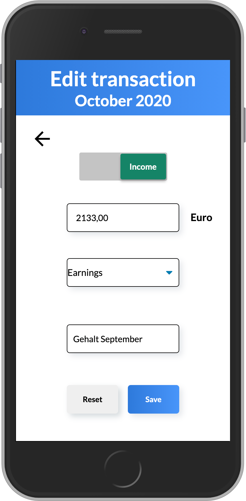

# Budgetly

## Never loose track of you monthly budget again!

It is so easy to lose track of your monthly expenses: The early morning coffee from the local bakery, going out to eat with friends, having a beer with colleagues... That's where Budgetly comes into play: Budgetly helps you to keep a comfortable overview of your financial status at any time.

This app was developed as my capstone project during the final four weeks of the neuefische Web Development Bootcamp in September 2020 in Hamburg, Germany.
Budgetly is optimized for mobile usage, so please switch your browser to responsive mode (iPhone 6/7/8)

Take a look at the app here here or watch the demo below.

## App impressions

  

## Tech stack

- React
- React Hooks
- React Router
- Styled Components
- Vercel
- PropTypes
- uuid
- Storybook
- Jest
- React Testing Library
- Cypress
- Formik
- Yup

## How to set it up

clone this repository, install all npm dependencies: `npm install`

to run the app in development mode `npm start`, then open http://localhost:3000 to view it in the browser

to run Storybook: `npm run storybook`

to run React Testing Library & Jest: `npm test`

to run Cypress `npm run cypress`
